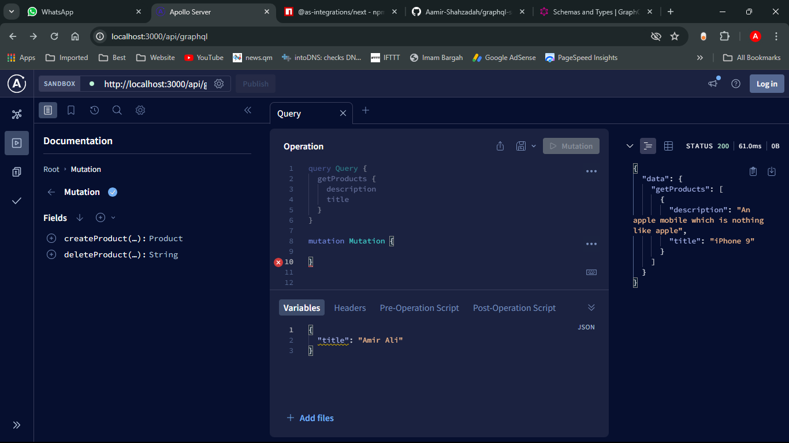
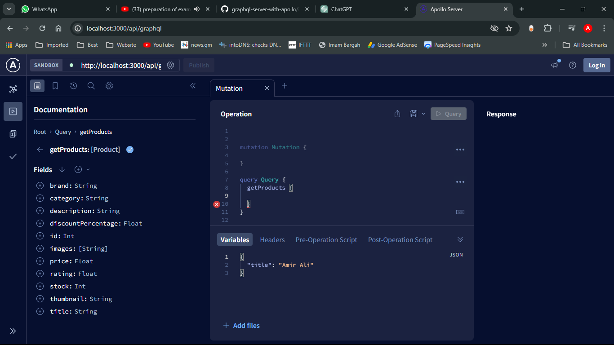

# Next.js + GraphQL Server

This project is a [Next.js](https://nextjs.org/) application bootstrapped with [`create-next-app`](https://github.com/vercel/next.js/tree/canary/packages/create-next-app) and integrated with GraphQL using `@apollo/server` and `@as-integrations/next`.

## Getting Started

### Run the Development Server

Use one of the following commands to start the development server:

```bash
npm run dev
# or
yarn dev
# or
pnpm dev
# or
bun dev
```

Open [http://localhost:3000](http://localhost:3000) in your browser to view the application.

### Editing the Page
Modify `app/page.tsx` to make changes to the main page. The page auto-updates as you edit the file.

### Font Optimization
This project uses [`next/font`](https://nextjs.org/docs/basic-features/font-optimization) to automatically optimize and load Inter, a custom Google Font.

## GraphQL Server Setup

### File Structure

The GraphQL API is located in:
```
app/api/graphql/route.ts (or route.js for JavaScript users)
```
Create the `api` and `graphql` folders under `app` if they do not exist.

### Installing Dependencies

Install the required GraphQL and Apollo Server packages:
```bash
npm install @as-integrations/next @apollo/server
```
Optionally, install `graphql-tag` for query parsing:
```bash
npm install graphql-tag
```

### GraphQL Queries
GraphQL queries can be written as raw strings:
```graphql
const query = `
  query {
    users {
      id
      name
    }
  }
`;
```

### API Operations
GraphQL supports the following operations:
- **Query** (Read data)
- **Mutation** (Modify data)
- **Subscription** (Real-time updates)

For more details on GraphQL types, refer to the official documentation: [GraphQL Type System](https://graphql.org/learn/schema/#type-system).

### Dummy Data API
You can use [DummyJSON](https://dummyjson.com/docs/products) for testing GraphQL queries with sample data.

## Learn More

To deepen your understanding of Next.js and GraphQL:
- [Next.js Documentation](https://nextjs.org/docs) - Learn about Next.js features and API.
- [Learn Next.js](https://nextjs.org/learn) - Interactive Next.js tutorial.
- [Apollo Server Integration](https://www.npmjs.com/package/@as-integrations/next#getting-started) - Guide on integrating Apollo Server with Next.js.

## Deployment

Deploy your Next.js app easily using [Vercel](https://vercel.com/new?utm_medium=default-template&filter=next.js&utm_source=create-next-app&utm_campaign=create-next-app), the creators of Next.js.

Refer to the [Next.js deployment documentation](https://nextjs.org/docs/deployment) for more details.


Get Post Put Delete          relly time 
Query ,    Mutation    Subscriptions


for types 
https://graphql.org/learn/schema/#type-system

api for dummy data 

https://dummyjson.com/docs/products




